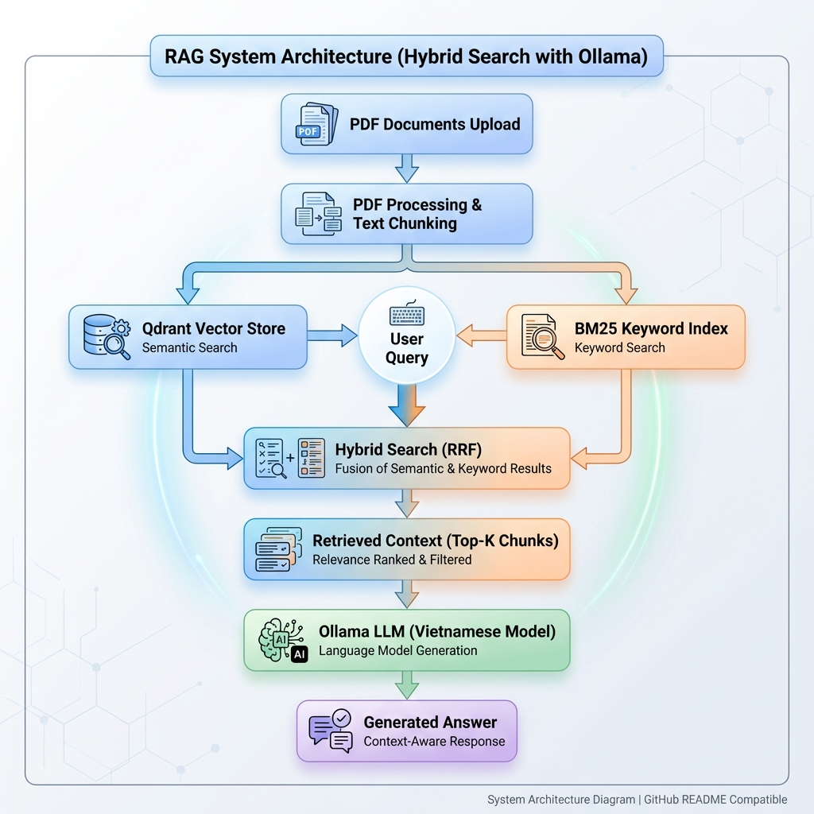

# Agricultural Support RAG System - Rice Disease Diagnosis

A RAG (Retrieval-Augmented Generation) system with Hybrid Search for Vietnamese agricultural documents and rice disease diagnosis.

## 🌾 Introduction

This system supports farmers and agricultural experts in finding information about:
- **Rice Diseases**: Symptoms, causes, and treatment methods
- **Cultivation Techniques**: Growing guides and production processes
- **Agricultural Solutions**: Technical advice based on professional documents

## ✨ Features

- 🔍 **Hybrid Search**: Combines semantic + keyword search for high accuracy
- 🤖 **Vietnamese LLM**: Natural Vietnamese responses (Ollama + Tuanpham/t-visstar-7b)
- 📚 **Document Search**: Upload PDFs about rice diseases and cultivation guides
- 📊 **Vector Database**: Qdrant - fast and accurate search
- 🎨 **Simple Interface**: Streamlit - easy for farmers to use

## 🎯 Real-world Applications

### For Farmers:
- Search rice disease symptoms from descriptions
- Get specific treatment instructions
- Learn cultivation techniques from guides

### For Experts:
- Quick information retrieval from professional documents
- Knowledge aggregation from multiple sources
- Technical consulting support

## 🏗️ System Architecture



The system follows a hybrid search approach combining semantic and keyword-based retrieval:

1. **PDF Processing**: Documents are uploaded and chunked into manageable segments
2. **Dual Indexing**: Text is indexed in both Qdrant (vector/semantic) and BM25 (keyword)
3. **Hybrid Search**: User queries trigger both search methods simultaneously
4. **RRF Fusion**: Results are merged using Reciprocal Rank Fusion for optimal relevance
5. **LLM Generation**: Retrieved context is sent to Ollama (Vietnamese model) for answer generation

## 🚀 Installation

### System Requirements

- **Python**: 3.10 or higher
- **Docker**: For Qdrant vector database
- **Ollama**: Local LLM runtime
- **RAM**: At least 4GB (recommended 8GB)

### Setup Guide

#### Step 1: Clone repository

```bash
git clone https://github.com/dylanvu6868/RAG_Argi.git
cd RAG_Argi
```

#### Step 2: Create virtual environment

```bash
python -m venv .venv

# Windows
.venv\Scripts\activate

# Linux/Mac
source .venv/bin/activate
```

#### Step 3: Install dependencies

```bash
pip install -r requirements.txt
```

#### Step 4: Configure Qdrant

**Option A: Use Qdrant Cloud (Recommended)**

1. Sign up at https://cloud.qdrant.io
2. Create a cluster and get your URL and API key
3. Update `.env` file:
```env
QDRANT_URL=https://your-cluster.cloud.qdrant.io:6333
QDRANT_API_KEY=your-api-key-here
```

**Option B: Run Qdrant Locally (Docker)**

```bash
docker run -d -p 6333:6333 -p 6334:6334 \
  -v $(pwd)/data/qdrant_storage:/qdrant/storage \
  --name qdrant_agriculture \
  qdrant/qdrant
```

Update `.env` file:
```env
QDRANT_URL=http://localhost:6333
QDRANT_API_KEY=  # Leave empty for local
```

#### Step 5: Install Ollama and Vietnamese model

```bash
# Install Ollama: https://ollama.com/download

# Pull Vietnamese model
ollama pull Tuanpham/t-visstar-7b:latest
```

#### Step 6: Run application

```bash
streamlit run app.py
```

Access: **http://localhost:8501**

## 📖 User Guide

### 1. Upload Documents

- Drag and drop PDF files about **rice diseases** or **cultivation guides**
- System automatically processes and indexes
- Supports multiple files at once

### 2. Ask Questions

**Example questions:**
- "What are the symptoms of rice blast disease?"
- "How to prevent brown spot disease?"
- "Rice has yellow leaves with spindle-shaped spots, what disease is it?"
- "Best time to apply nitrogen fertilizer?"

### 3. View Results

- Detailed answers in Vietnamese
- Clear source citations (filename, page number)
- Conversation history for reference

## ⚙️ Configuration

### `.env` File

```env
QDRANT_URL=http://localhost:6333
QDRANT_API_KEY=  # Leave empty for local
```

### `config.py` - Optimized for Agricultural Texts

```python
CHUNK_SIZE = 1000              # 1000 characters per chunk
CHUNK_OVERLAP = 200            # Overlap to preserve context
OLLAMA_MODEL = "Tuanpham/t-visstar-7b:latest"
LLM_TEMPERATURE = 0.3          # Low = focused answers
SEARCH_TYPE = "hybrid"         # Combine semantic + keyword
TOP_K_RESULTS = 5              # Retrieve top 5 relevant chunks
```

## 🔧 Technology Stack

| Component | Technology |
|-----------|-----------|
| **Frontend** | Streamlit |
| **LLM** | Ollama (Tuanpham/t-visstar-7b) |
| **Vector DB** | Qdrant |
| **Embeddings** | sentence-transformers/all-MiniLM-L6-v2 |
| **Text Chunking** | LangChain RecursiveCharacterTextSplitter |
| **Keyword Search** | BM25Okapi |
| **Fusion** | Reciprocal Rank Fusion (RRF) |

## 📊 Performance

- **Hybrid Search**: 15-20% accuracy improvement vs semantic-only
- **Response Time**: 3-5 seconds (depends on hardware)
- **Memory**: ~2GB RAM (embedding model + LLM)
- **Language**: Vietnamese agricultural terminology support

## 📁 Project Structure

```
RAG_Argi/
├── app.py                    # Streamlit UI
├── rag_engine.py             # RAG logic + Hybrid Search
├── llm_handler.py            # Ollama integration
├── config.py                 # System configuration
├── utils.py                  # Utility functions
├── requirements.txt          # Dependencies
├── .env                      # Environment variables
├── .gitignore               # Git ignore
└── data/
    ├── uploaded_pdfs/        # Agricultural documents
    ├── qdrant_db/           # Vector storage
    └── vector_database_debug/ # Debug info
```

## 💡 Recommended Documents to Upload

- Rice disease guides
- VietGAP rice production processes
- Cultivation technique handbooks
- Fertilizer and pesticide documentation
- Disease prevention guidelines

## 🤝 Contributing

Open for the agricultural community! All contributions welcome:
1. Fork repository
2. Create feature branch (`git checkout -b feature/NewFeature`)
3. Commit changes (`git commit -m 'Add NewFeature'`)
4. Push to branch (`git push origin feature/NewFeature`)
5. Create Pull Request

## 📞 Contact & Support

- **GitHub Issues**: Report bugs or suggest features
- **Repository**: https://github.com/dylanvu6868/RAG_Argi

## 🙏 Acknowledgments

- **Ollama**: https://ollama.com - Local LLM runtime
- **Qdrant**: https://qdrant.tech - Vector database
- **LangChain**: https://langchain.com - RAG framework
- **Model**: Tuanpham/t-visstar-7b - Vietnamese LLM

---

**Developed by**: Dylan Vu  
**Purpose**: Supporting Vietnamese farmers & agricultural experts
